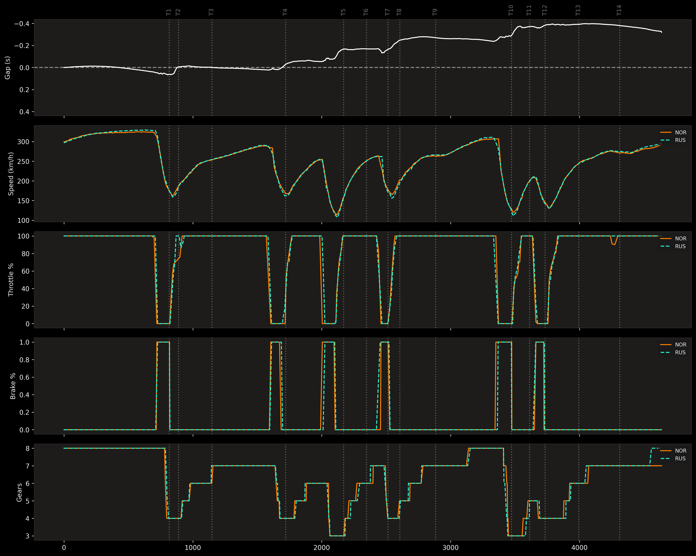

🏎️ My F1 Telemetry & Data Lab
I built this project to dive deep into Formula 1 data analysis. As a Computer Science student and an F1 fan, I wanted to go beyond what the TV broadcast shows and understand how drivers like Norris and Verstappen manage their pace and tires.

🛠 What I’ve built so far
Telemetry Visualizer: A 5-panel dashboard comparing Speed, Throttle, Brake, and Gears.

The "Gap" Challenge: I developed a custom delta calculator using linear interpolation (NumPy) to solve data synchronization issues in tight tracks like Monaco.

Sector Breakdown: A script that extracts timing data to see exactly where a car is gaining or losing time (S1, S2, S3).

Tyre Management: A race pace analyzer that filters specific stints to visualize thermal degradation.

🧠 Key Problems I Solved
Data Inconsistency: F1 sensors don't always ping at the same time. I had to implement a common distance grid to make the "Time Gap" line accurate across the whole lap.

Telemetry Noise: Cleaning up race data to remove pit stops and Safety Car laps using pick_quicklaps to get a clear view of tire wear.

Circuit Mapping: Instead of hardcoding corners, I automated the process using the FastF1 API to fetch corner coordinates for any track.

📊 Sample Results
Qualifying Analysis (Barcelona)
In this plot, you can clearly see how the McLaren (Norris) manages to carry more speed through the technical sector 2 compared to the Mercedes (Russell).

Race Pace & Degradation
Comparing the first stint between Norris and Verstappen. It shows how Verstappen’s Red Bull keeps a flatter pace line while Norris experiences more "spikes" in lap times during the 2024 Spanish GP.

📈 Future Roadmap
DRS Efficiency: Measuring the exact speed gain and time delta during DRS-enabled laps.

Weather Impact Analysis: Correlation between track temperature and tire degradation slopes.

3D Track Mapping: Using GPS coordinates to build a 3D visualization of the circuit with speed-based heatmaps.

💻 My Stack
Language: Python 3.12

Libraries: FastF1, Pandas, NumPy, Matplotlib