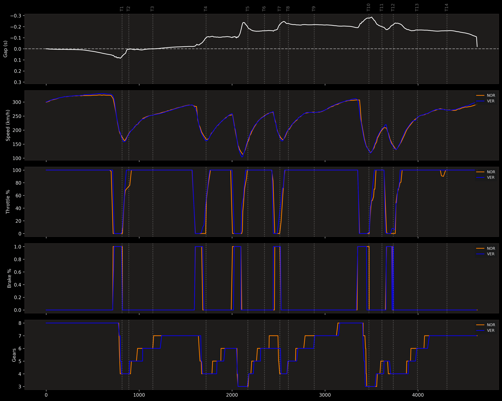
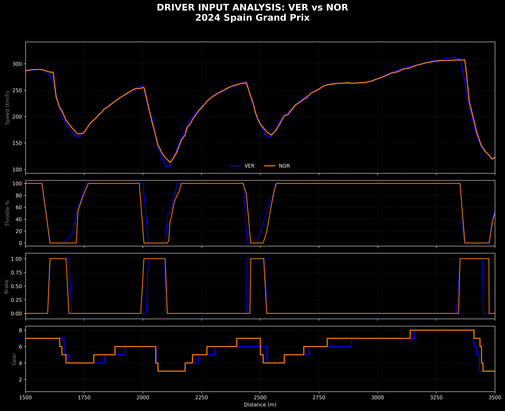
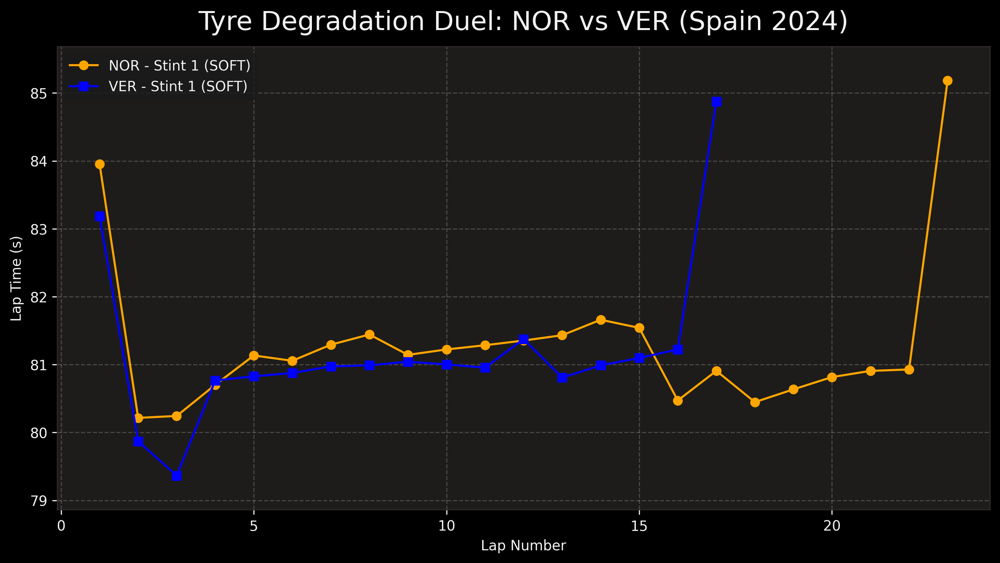

# 🏎️ My F1 Telemetry & Data Lab

I built this project to dive deep into **Formula 1 data analysis**. As a Computer Science student and an F1 fan, I wanted to go beyond what the TV broadcast shows and understand how drivers manage their pace, tires, and racing lines through data-driven insights.

---

## 🚀 Analysis Suite & Features

### 🏁 Core Timing & Strategy (v1)
* **Sector Breakdown**: Extracts timing data to see exactly where a car is gaining or losing time across Sector 1, 2, and 3.
* **Tyre Management**: A race pace analyzer that filters specific stints to visualize thermal degradation and lap time consistency.
* **The "Gap" Challenge**: A custom delta calculator developed to solve data synchronization issues in tight tracks like Monaco.

### 📊 Professional Telemetry (v2)
* **Master Telemetry Dashboard**: A 5-panel synchronized visualizer that aligns **Time Gap, Speed, Throttle, Brake, and Gear selection** with geographical corner markers (T1, T2, etc.).
* **Track-Speed Heatmaps**: Projects telemetry onto circuit coordinates (X, Y) with speed gradients to identify apex speeds and braking zones.
* **Speed Delta Maps**: Uses divergent colormaps to highlight exactly where one driver is faster (Red) vs. their rival (Blue) along the physical track layout.

---

## 🧠 Technical Problems I Solved

1. **Data Inconsistency & Sync**: F1 sensors don't always ping at the same time. I implemented **Linear Interpolation (NumPy)** to create a common distance grid, allowing for a 1:1 "apples to apples" comparison.
2. **Telemetry Noise**: Implemented logic to clean up race data, removing pit stops and non-representative laps (Safety Car, Out laps) using `pick_quicklaps`.
3. **Identity & Performance**: 
    * Automated official **Team Color** extraction via API for professional branding.
    * Implemented an automatic **Caching System** to handle massive telemetry datasets and reduce script execution time.
4. **Dynamic Circuit Mapping**: Automated corner coordinate fetching and labeling (T1, T2...) using the FastF1 API to ensure the lab works for any Grand Prix on the calendar.

---

## 📊 Sample Results: The Battle for Spain 2024 (VER vs NOR)

To demonstrate the lab's capabilities, I analyzed the fight for Pole Position between **Max Verstappen** and **Lando Norris**.

### 1. Full Lap Master Dashboard
The ultimate overview. It synchronizes the **Time Gap** with every driver input and geolocates them using turn markers (T1-T14) across the entire lap.

<p align="center">
  
</p>

### 2. Deep Dive: Technical Sector Analysis (Driver Inputs)
By zooming into the technical middle sector (1500m - 3500m), we can see the "micro" differences. This view highlights exactly how Norris (Orange) applies the throttle earlier than Verstappen (Blue) on corner exits.

<p align="center">
  
</p>

### 3. Speed Delta & Track Performance
A divergent map showing the trade-off between straight-line efficiency and mid-corner speed.

<p align="center">
  
  
</p>

### 4. Race Pace & Tyre Degradation
Analysis of the first stint showing the consistency of both drivers and the "performance cliff".

<p align="center">
  
</p>

---

## 💻 Tech Stack

* **Language**: Python 3.12
* **Core Libraries**: `FastF1`, `Pandas`, `NumPy`, `Matplotlib`

---

## 🚀 How to Run

1. **Clone the repository**:
   ```bash
   git clone [https://github.com/tu-usuario/f1-telemetry-lab.git](https://github.com/tu-usuario/f1-telemetry-lab.git)